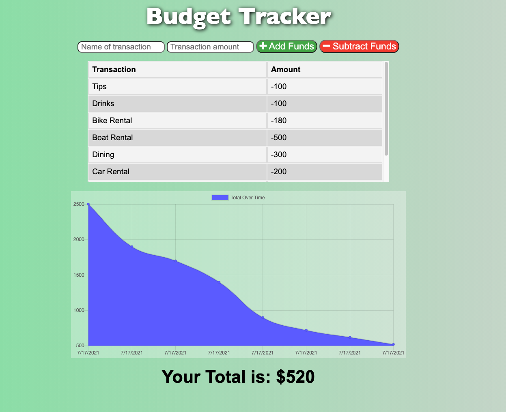

# PWA_Budget-Tracker
Budget Tracker Application with offline access and functionality

GitHub Repo: [/Robert-Schwartz/PWA_Budget-Tracker](https://github.com/Robert-Schwartz/PWA_Budget-Tracker)  

Deployed at: [https://rs-budget-tracker.herokuapp.com/](https://rs-budget-tracker.herokuapp.com/)  

## Description
A PWA mobile-first application designed for a user to add and subtract financial transactions to create a budget.  The application is PWA ready to work offline when there is no internet connection available.
## Table of Contents
- [Technologies](#Technologies)
- [Installation](#Installation)
- [Usage](#usage)
- [Contributions](#Contributions)
- [Contact](#Contact)
- [License](#license)

## Technologies
This project was built using HTML, CSS, Javascript, Bootstrap styling, as well as:

* Node
* NoSQL
* Express
* MongoDB
* MongoDB Atlas

## Installation
- Clone the repo:
use `https://github.com/Robert-Schwartz/PWA_Budget-Tracker.git` in the command line

- Install npm required dependencies by running (`npm i`) in the command line.

## Usage
- Visit deployed website to be taken to the homepage.
- Enter each transaction in the forms to add and subtract funds.

## Contributions
Developed by Robert Schwartz, 2021

## Contact
Contact me with any questions
- Github Profile: (https://github.com/Robert-Schwartz)
- E-mail me: bschwartz23@gmail.com

## License
NPM MIT